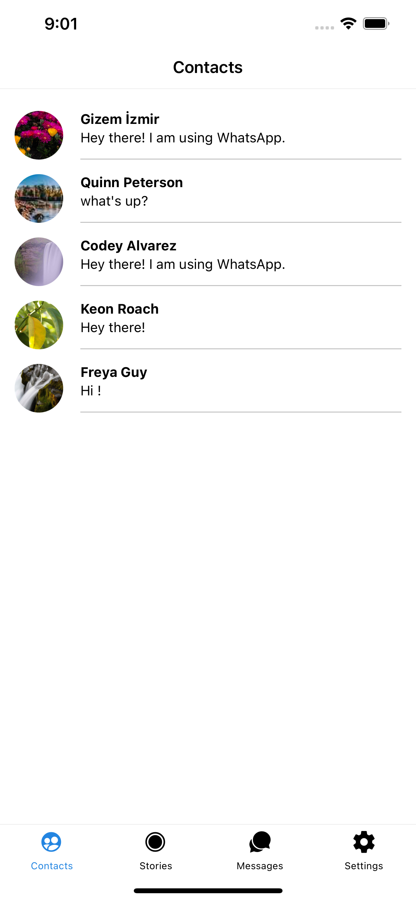
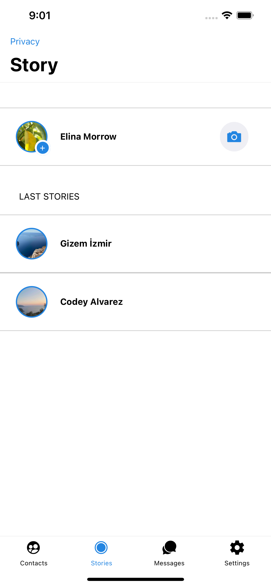
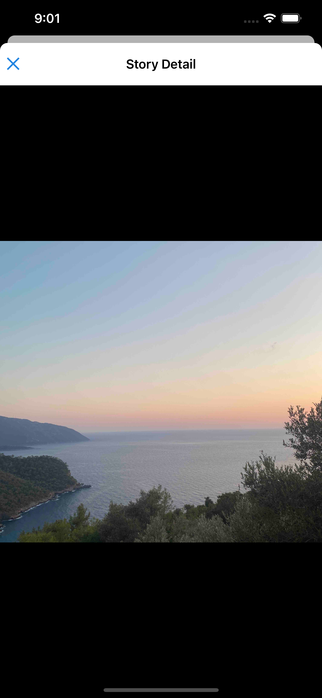

# React Native Chat App - Final Project

EN - This project is the final project assignment within the scope of "Akbank React Native Bootcamp" organized by Patika.dev. 

TR - Bu proje Patika.dev 'in düzenlediği "Akbank React Native Bootcamp" kapsamında yapılan Final Proje ödevidir.
<br/><br/>

## Technologies


<br/>

## Packages

- Expo
- Expo Map
- Expo Location
- Expo Image Picker
- Firebase
- Axios
- React Navigation
- Async Storage
- ReduxJS Toolkit
- React Hook Form

<br/>

## Features

- Sign in Screen
- Sign up Screen
- Home Screen
- Chat Screen
- Contacts Screen
- Story Screen
- Theme Setting Screen
- Profile Setting Screen
- Supports dark/light mode 🌗
- Map view

<br/>

## Todo

- Story Edit
- More story details
- New additional features to the settings page

<br/>

## Installation

```
yarn install
yarn start
```

<br/>

### ScreenShot Light / Dark Theme

<table>
    <tbody>
        <tr>
            <td></td>
            <td></td>
        </tr>
        <tr>
            <td></td>
            <td></td>
        </tr>
        <tr>
            <td></td>
            <td></td>
        </tr>
        <tr>
            <td></td>
            <td></td>
        </tr>
        <tr>
            <td></td>
            <td></td>
        </tr>
        <tr>
            <td></td>
            <td></td>
        </tr>
        <tr>
            <td></td>
            <td></td>
        </tr>
        <tr>
            <td></td>
            <td></td>
        </tr>
        <tr>
            <td></td>
            <td></td>
        </tr>
        <tr>
            <td></td>
            <td></td>
        </tr>
        <tr>
            <td></td>
            <td></td>
        </tr>
    </tbody>
</table>